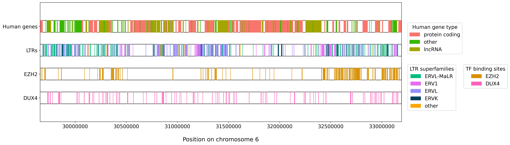
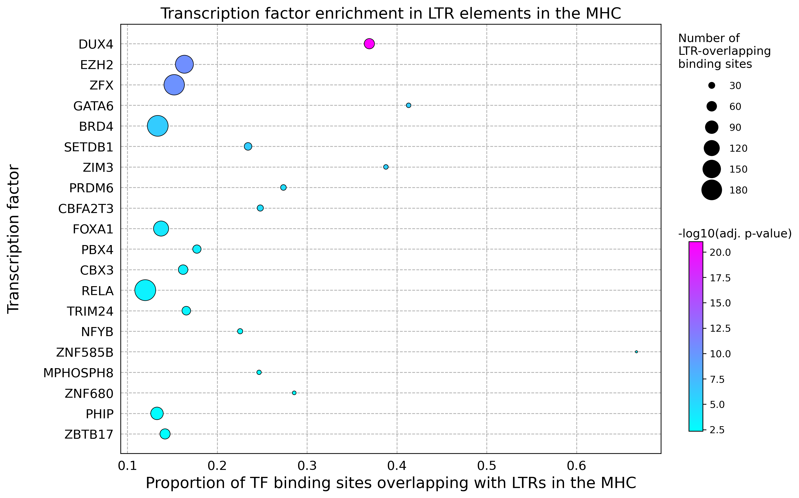

# EnrichERV: Analysing HERV enrichment

This repository contains code for analysing enrichment of human endogenous retroviruses (HERVs) in different regions of the genome, either with respect to abundance (density of HERV elements) or transcription factor binding sites (overlap between binding sites and HERV elements). We include notebooks that apply these methods to analyse endogenous retroviral elements in the MHC. Due to size constraints, raw data is not included.

We plan to convert our code into a package soon.

## Visualising the genomic distribution of LTR elements in the MHC

The [`plotHERVs.ipynb`](notebooks/plot_MHC_HERVs.ipynb) notebook generates a visualisation of LTRs and human genes in the MHC, as well as binding sites for
two transcription factors enriched in LTR sequences: EZH2 and DUX4.

## Quantifying transcription factor enrichment in LTR sequences

The [`TFanalysis.ipynb`](notebooks/MHC_TF_analysis.ipynb) notebook contains an analysis of transcription factor binding site enrichment
in LTR elements in the MHC. We use a hypergeometric test to infer whether a given transcription factor's binding sites are
overrepresented in LTR sequences.

